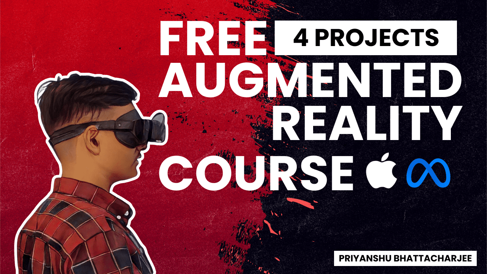

 

  

# Augmented Reality

Augmented Reality (AR) is a technology that combines computer-generated elements with the real world, enhancing the user's perception and interaction with their environment. AR overlays digital information such as images, videos, or 3D models onto the real world, usually through a smartphone, tablet, or wearable device.

## Use Cases of Augmented Reality

AR has a wide range of applications across various industries. Some common use cases of augmented reality include:

1. **Gaming**: AR has revolutionized the gaming industry by creating immersive and interactive experiences, allowing users to interact with virtual objects in their real environment.

2. **Education**: AR is being used in education to provide interactive and engaging learning experiences. It can bring static concepts to life, making it easier for students to understand complex subjects.

3. **Retail**: AR is used in retail to enhance the shopping experience. It allows customers to try on virtual clothes, visualize furniture in their homes before buying, and even see how products work through virtual demonstrations.

4. **Healthcare**: AR is being used in healthcare for various purposes, such as surgical training, patient education, and visualization of medical data.

5. **Architecture and Interior Design**: AR can be used to visualize and present architectural designs, allowing clients to see how a building or interior space will look before construction begins. It enables real-time adjustments and improvements, enhancing the design process.

6. **Navigation and Wayfinding**: AR can assist users in navigating their surroundings by overlaying directions, points of interest, and real-time information onto their field of view. This technology is particularly useful in complex indoor environments like airports, shopping malls, or museums.

7. **Virtual Try-On in Retail**: AR enables virtual try-on experiences, allowing customers to visualize how clothing, accessories, or cosmetics will look on them without physically trying them on. This enhances the online shopping experience and reduces returns.

## Prerequisites

Before diving into augmented reality development, ensure you have the following prerequisites:

- At least 4GB RAM
- An i3 (or equivalent) processor
- Stable internet connection
- An ARCore enabled smartphone

## Download The Project Assets

You can download the following projects to get started with augmented reality development:

1. **PlanetAR**
PlanetsAR is an awe-inspiring augmented reality app that allows users to explore the stunning beauty of our solar system's planets. Using a smartphone or tablet, the app brings the planets to life, offering an up-close and detailed view of their unique features. From the intricate patterns on Jupiter to Saturn's majestic rings and Mars' red landscapes, PlanetsAR provides an immersive and seamless experience. With educational content and fascinating facts about each planet, it's a fantastic tool for learning and igniting curiosity about our universe. Whether you're a space enthusiast or simply captivated by the cosmos, PlanetsAR offers an unforgettable journey through space in the palm of your hand.
* **[Download Assets Of PlanetsAR](https://drive.google.com/file/d/1RJ5HTBoulOQV9tdVHLOZPmen9CQNvp5Q/view?usp=drive_link)**

2. **Jet Turbine Simulation**
Jet Turbine Simulation is a cutting-edge augmented reality application that allows users to dive into the inner workings of a jet turbine engine. With this app, you can explore and understand the intricate components that make up this powerful machinery. Using your device, simply launch the app and witness a virtual jet turbine come to life in your surroundings. Dive deep into the engine to examine each component up close, from the blades to the combustion chamber. Jet Turbine Simulation offers a unique and educational experience, giving users a deeper understanding of the fascinating world of jet turbine technology.
* **[Download Assets Of Jet Turbine Simulation](https://drive.google.com/file/d/1mC97RGYk2uG4baBPdmLqsZuWaRamksjL/view?usp=drive_link)**

3. **GardeniAR**
GardeniAR is an enchanting augmented reality app that brings the beauty of gardening indoors. With this app, users can plant and nurture virtual plants right in their own rooms. Simply launch the app on your device and select from a variety of stunning plants to place and grow within your surroundings. Watch as your chosen plants flourish and bloom over time, providing a delightful and immersive experience. GardeniAR allows users to bring nature indoors, providing the joy of gardening and the satisfaction of watching plants thrive, all within the convenience of your own space.
* **[Download Assets Of GardeniAR](https://drive.google.com/file/d/1tLCaxNuI0Ex1fNWLLxAb5yOW98Dxi6Gz/view?usp=drive_link)**

4. **FurnishAR**
FurnishAR is a revolutionary augmented reality app that enables users to effortlessly furnish their rooms with virtual furniture. With this app, you can explore a vast collection of furniture options and virtually place them in your room to see how they fit and complement your existing decor. From sofas and tables to lamps and artwork, FurnishAR offers an extensive selection of furniture pieces from various styles and brands. Experience the thrill of designing and decorating your space without the hassle of physically moving furniture. FurnishAR lets you unleash your creativity and transform your room with ease, making interior design a truly immersive and enjoyable process.
* **[Download Assets Of FurnishAR](https://drive.google.com/file/d/1939fqf6O9rml9M8r5Uj1B8LC0Nwmtmom/view?usp=drive_link)**

## Grab Yourself A Free Roadmap
Want to learn more about Augmented Reality in depth? Grab yourself a free roadmap that would guide your through your journey of becoming a professional Extended Reality Developer
- [Augmented Reality Development Roadmap](https://www.example.com/roadmap)
